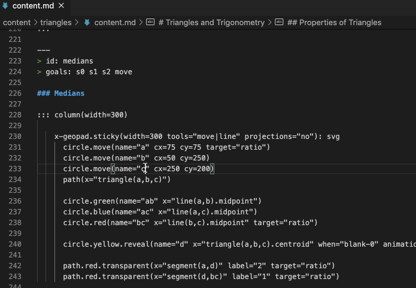
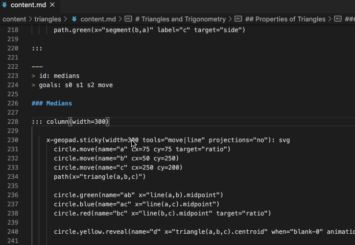
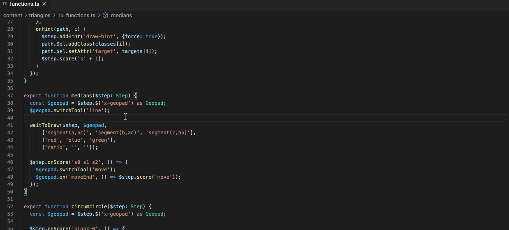
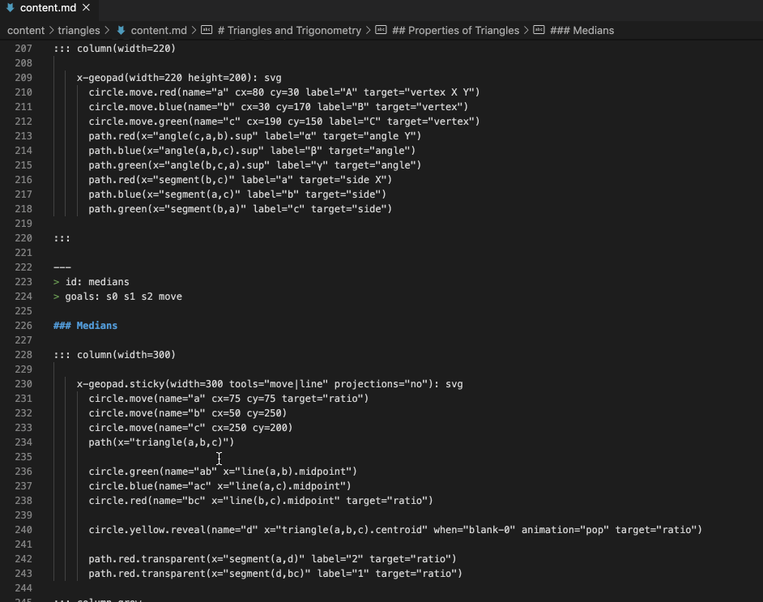
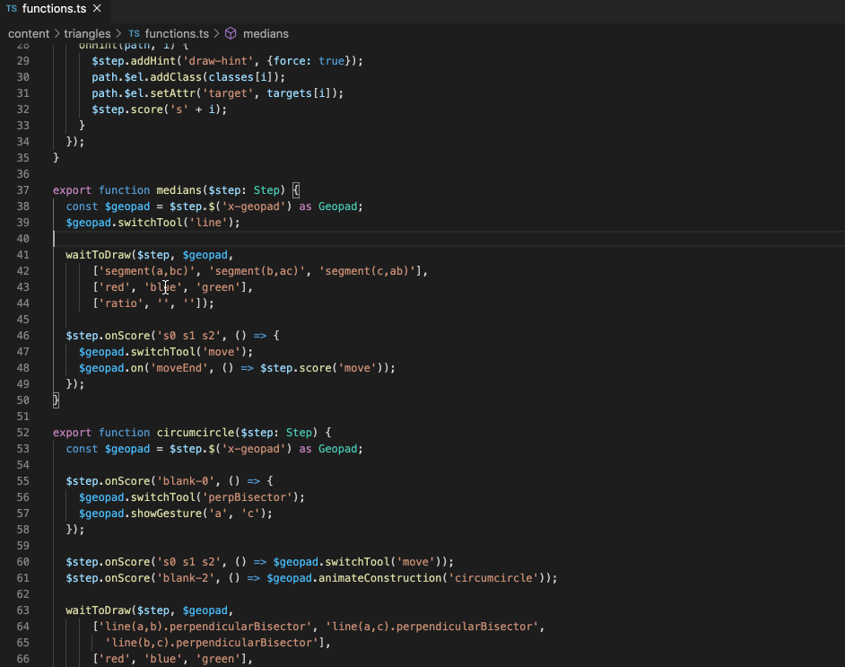
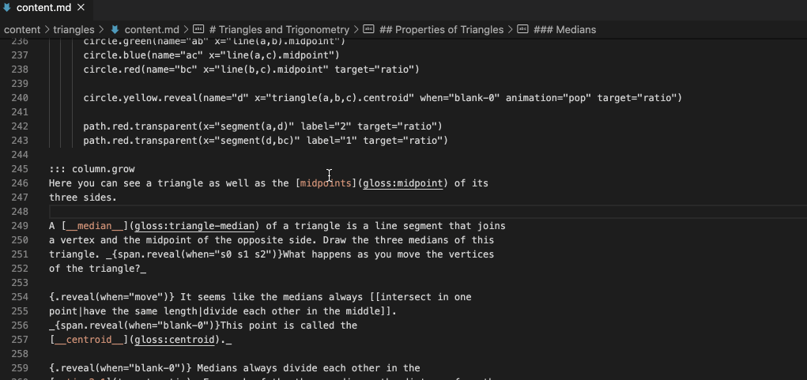
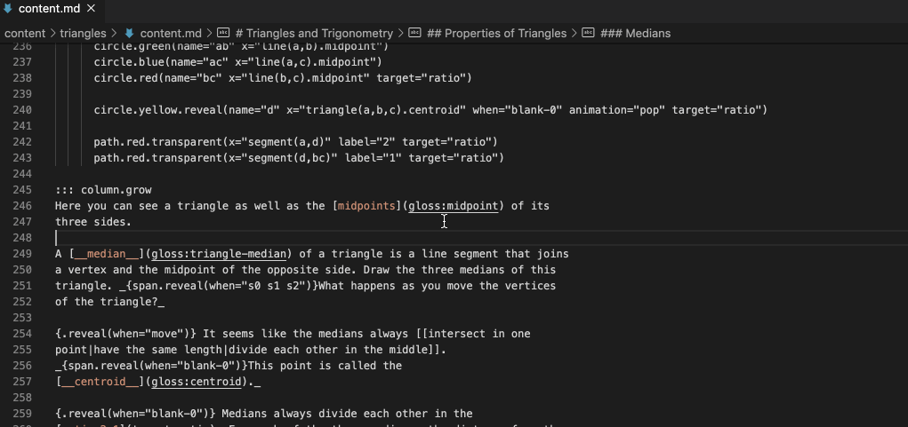
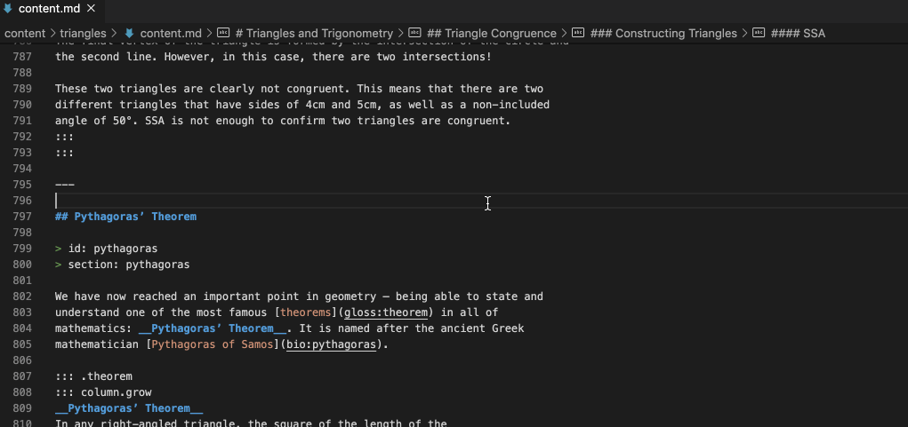

# Mathigon VS Code Extension

This is an Extension for [Visual Studio Code](https://code.visualstudio.com/) to help navigate the code for [Mathigon textbooks](https://github.com/mathigon/textbooks).

## Set up.

Clone this repo into your vscode extensions folder. Depending on your platform, the location is in the following folder:
- Windows: `%USERPROFILE%\.vscode\extensions`
- macOS: `~/.vscode/extensions`
- Linux: `~/.vscode/extensions`

## Features

### Step Definition Jumping
When editing a *content.md* markdown file, you can use the [Go to Definition](https://code.visualstudio.com/Docs/editor/editingevolved#_go-to-definition) command on a Step's ID to navigate to the function where that Step's JavaScript defined. 

When the cursor is over the id, there are two ways to navigate to the definition:
    
- press `F12`
- hold `Option` (Mac) or `Ctrl` (PC) and click

You can also hold `Option` (Mac) or `Ctrl` (PC) and hover the mouse over the ID to see a preview of the function. 

#### From functions.ts to content.md
You can also go the other way, from the function to the ID in content.md, with the same key combinations. However, you must make some extra clicks because the function will also point to itself as a definition.

#### Within-step Jumping
If you are in the middle of a step (in content.md) or a function (in functions.ts), you can jump to the complementary location in the other file by using the __Mathigon Step Finder__ command. Press `Command`+`Shift`+`P` (Mac) or (whatever the PC combo is) to open the command menu. Then type/navigate to "Mathigon Step Finder" and click or press enter, and you will jump to the other file.

From content to functions.

From functions to content.

### Glossary Definition Lookup.
When editing a *content.md* markdown file, you can use the [Go to Definition](https://code.visualstudio.com/Docs/editor/editingevolved#_go-to-definition) command to jump to or preview a term's definition in the glossary.

Press `F12` or hold `Option` and click on a glossary term to jump to its definition.

Or hold `Option` and hover over the term to preview its definition.

This also works for bios.

Change into this directory and run `npm install`.

## Release Notes

### 1.0.0
Initial Release. Has features for Step Definition Lookup and Gloss/Bio Definition Lookup.

## TODO List
- Remove/Improve Log Statements
- add camelCase to hyphen-format function
- add a Keyboard shortcut for the Step Finder.

